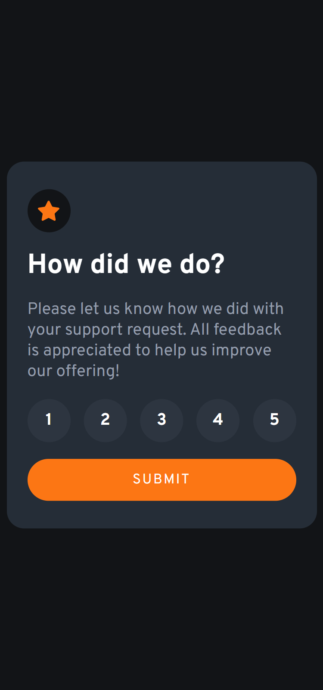
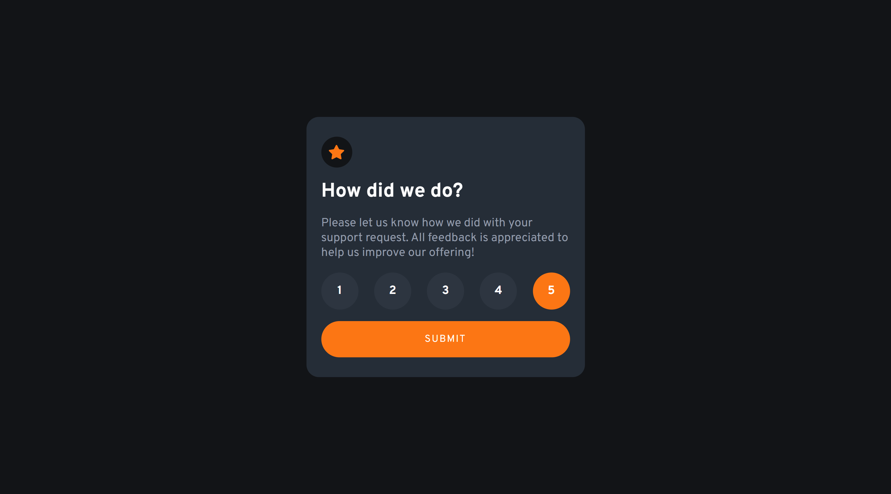
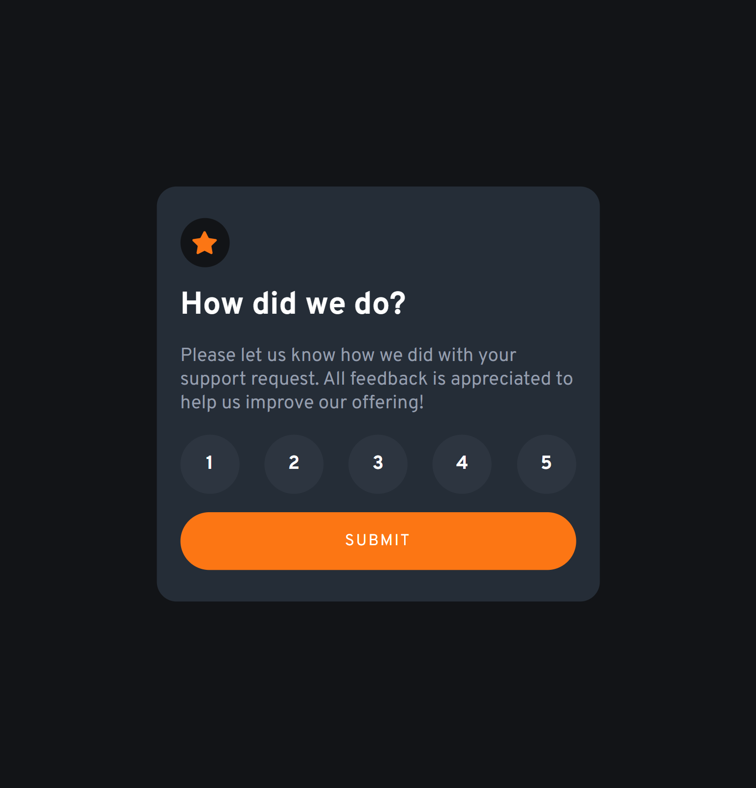

# Frontend Mentor - Interactive rating component solution

This is a solution to the [Interactive rating component challenge on Frontend Mentor](https://www.frontendmentor.io/challenges/interactive-rating-component-koxpeBUmI). Frontend Mentor challenges help you improve your coding skills by building realistic projects.

## Table of contents

- [Overview](#overview)
  - [The challenge](#the-challenge)
  - [Screenshot](#screenshot)
  - [Links](#links)
- [My process](#my-process)
  - [Built with](#built-with)
  - [What I learned](#what-i-learned)
- [Author](#author)

## Overview

### The challenge

Users should be able to:

- View the optimal layout for the app depending on their device's screen size
- See hover states for all interactive elements on the page
- Select and submit a number rating
- See the "Thank you" card state after submitting a rating

### Screenshot

### Links

- Solution URL: [Github Repo](https://interactive-ratings-smartlify.netlify.app)
- Live Site URL: [Add live site URL here](https://github.com/Smartlify08/Interactive-ratings-component)

## My process

### Built with

- CSS custom properties
- Flexbox
- CSS Grid
- Mobile-first workflow

### What I learned

I learned how to use timeouts for the error message.

To see how you can add code snippets, see below:

## Author

- Website - [Anosike Obinna Smart](https://superb-pony-63b1e3.netlify.app/)
- Frontend Mentor - [@yourusername](https://www.frontendmentor.io/profile/Smartlify08)
